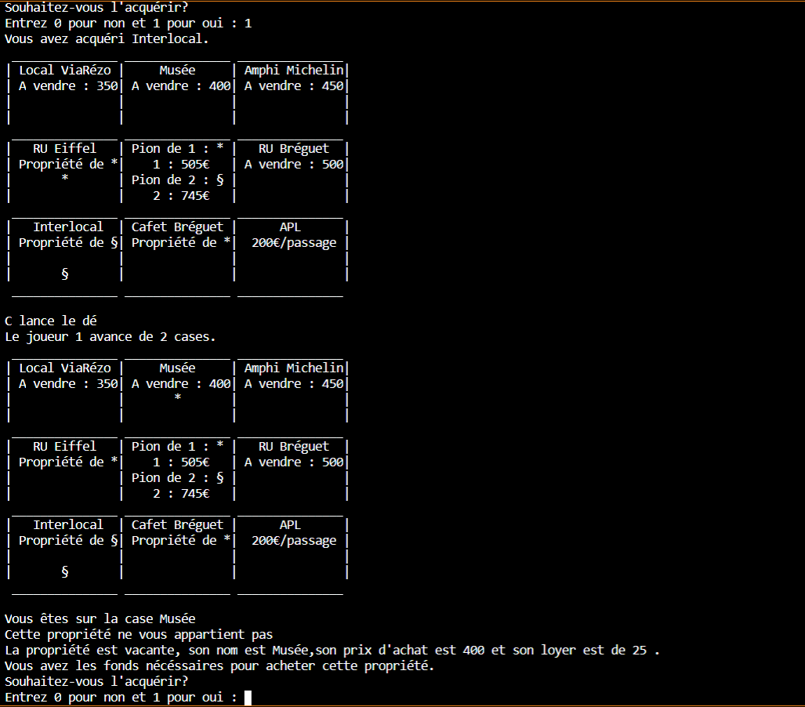
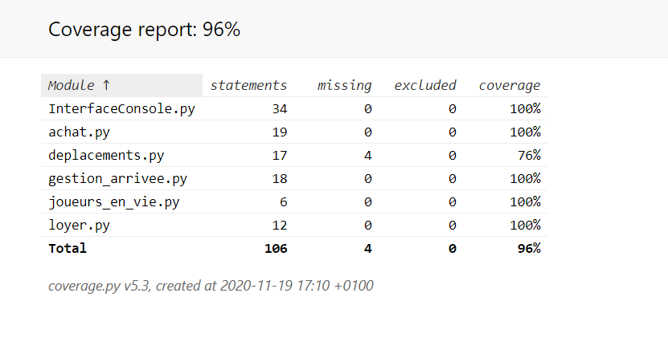
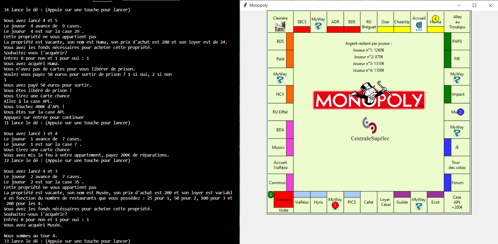

# Projet Coding Weeks - Semaine 2 - Equipe 09
## Description 
-> Ce projet est celui de l'équipe 09 du pôle 2048 de la seconde semaine des coding weeks. Le but de ce projet est de créer un jeu de **Monopoly version CentraleSupélec** à l'aide du **langage Python**.

## Team Equipe 9
La liste des membres ayant travaillé sur ce projet est : 

-> Cyprien Pierrot (Délégué)

-> Téo Chaillou

-> Eglantine Collet-Manent

-> Hugo Crepel

-> Thomas Giudicissi

-> Louis Beutter


*Référents du groupe : Myriam Tami / Romain Pascual*

## Idée du code

Afin de faire fonctionner ce jeu de Monopoly, chacune des versions possède : 

-> Un dictionnaire `monopoly` gérant la liste des propriétés. Il contient les clés 'nom' (pour le nom de la propriété), 'possédé' (indique, si la propriété peut être achetée, son propriétaire : 0 si elle n'appartient à personne, i si elle est possédée par le joueur i), 'prix_achat' (contenant le prix d'achat de la propriété) et 'loyer' (contenant pour les propriétés à loyer fixe la valeur de ce loyer)

*NB : Le dictionnaire contient aussi dans les versions plus avancées du projet les clés 'maison' (qui donne le nombre de maisons présentes sur la propriété) et 'prix maison' (qui donne le prix d'une maison sur la propriété, si on peut y acheter des maisons*)


-> Un dictionnaire `joueurs` permettant de gérer l'état de chaque joueur. Il contient les clés 'nom' (stockant le nom du joueur), 'argent' (stockant l'argent de chaque joueur), 'position' (donnant la position sur le plateau des joueurs).

*NB : Le dictionnaire contient aussi dans les versions plus avancées du projet les clés 'prison' (contenant pour chaque joueur une variable valant 0 si le joueur n'est pas en prison, 1 s'il est en prison depuis ce tour, 2 s'il est en prison depuis 2 tours et 3 si c'est son troisième tour en prison), 'libere de prison' (qui donne le nombre de cartes "libéré de prison" que le joueur possède) et 'dernier lancer dés' (qui stocke la valeur du dernier lancer de dés du joueurs)*


-> Un affichage graphique, soit sur la console, soit à l'aide de la bibliothèque tkinter de Python.


-> Une fonction achat gérant l'achat de propriétés.


-> Une fonction loyer gérant le payement le loyer d'un joueur à un autre.


-> Une fonction deplacements gérant les lancers de dé du joueur sur le plateau.


-> Une fonction gestion_arrivee gérant l'arrivée d'un joueur sur une case et déclenchant les programmes nécessaires.


-> Une fonction réunissant toutes les sous-fonctions pour obtenir un jeu fonctionnel en une seule commande.

## Requirements

Afin de faire fonctionner le projet au mieux, il est nécessaire d'installer quelques bibliothèques à l'aide des commandes suivantes dans votre terminal bash :


-> Tkinter, bibliothèque gérant l'interface graphique : `pip install tkinter`

-> PIL (Python Imaging Library), bibliothèque de traitement d'images : `pip install pillow`


Afin d'exécuter les programmes de test, il vous sera aussi nécessaire d'installer la bibliothèque suivante :


-> Pytest, framework de test pour Python : `pip install pytest`


*NB : Les bibliothèques suivantes sont aussi utilisées, mais devraient être installées par défaut : random, io, sys*

## Travail effectué

Vous pouvez retrouver le travail effectué et le travail en cours dans le fichier DescriptionSprints.md

Une vidéo de démonstration du MVP et du projet à l'issue du Sprint 2 est disponible à l'adresse suivante : https://youtu.be/tr_THmqC6Lk


## Exécution du MVP

Dans le dossier MVP se trouve les fonctions permettant l'exécution de notre MVP, le produit obtenu à l'issue du sprint 1. C'est un monopoly jouable à **2 joueurs sur une grille 3*3 en interface console**.   
Pour le lancer, ouvrez et exécutez le code contenu dans **faire_jouer_les_joueurs.py**, puis entrez dans votre terminal Python : `play_monopoly()`


Image :



## Couverture de test du MVP

Toutes les fonctions unitaires du MVP ont été testées et couvertes par des tests réalisables avec la bibliothèque pytest.

Seule la fonction play_monopoly() de faire_jouer_les_joueurs.py n'a pas été couverte par pytest car c'est la fonction qui articule toutes les autres, elle a donc été testée en jouant avec le MVP.
Pour tester un fichier test en particulier, rentrez "pytest [nom du fichier test]" (en n'oubliant pas le .py).
Nous avons ensuite fait un test de couverture, et on obtient un pourcentage de couverture global de 96%.
Le fichier html correspondant est dans htmlcov et est couverture_globale.html

Image du résultat du test de couverture globale:



## Exécution du jeu obtenu à l'issue du Sprint 2

Dans le dossier Sprint 2 Finalisé se trouve les fonctions permettant l'exécution de notre jeu à l'issue du sprint 2. Le jeu dispose alors d'une interface graphique faite à l'aide de tkinter, d'une grille 11*11 (tel le plateau classique de Monopoly) et de nouvelles fonctionnalités.

Pour le lancer, ouvrez et exécutez le code contenu dans **JeuAvecGraphismes.py** (ou entrez dans votre terminal bash : `python JeuAvecGraphismes.py`)

La clause
```
if __name__ == "__main__":
    jouer_monopoly()
```

devrait lancer le jeu automatiquement, mais si ce n'est pas le cas, vous pouvez alors entrer manuellement dans votre terminal Python la commande : `jouer_monopoly()`


Image : 



## Exécution du jeu obtenu à l'issue du Sprint 3

Dans le dossier Sprint 3 Finalisé se trouve les fonctions permettant l'exécution de notre jeu à l'issue du sprint 3. Le jeu dispose désormais d'un système d'achat et de revente de maisons, et de tableaux de bord affichant les données des joueurs en temps réel.

Pour le lancer, exécutez le code contenu dans **jeu_avec_maison.py** (ou entrez dans votre terminal bash `python jeu_avec_maison.py`).

La clause
```
if __name__ == "__main__":
    jouer_monopoly()
```

devrait lancer le jeu automatiquement, mais si ce n'est pas le cas, vous pouvez alors entrer manuellement dans votre terminal Python la commande : `jouer_monopoly()`

Image : 

